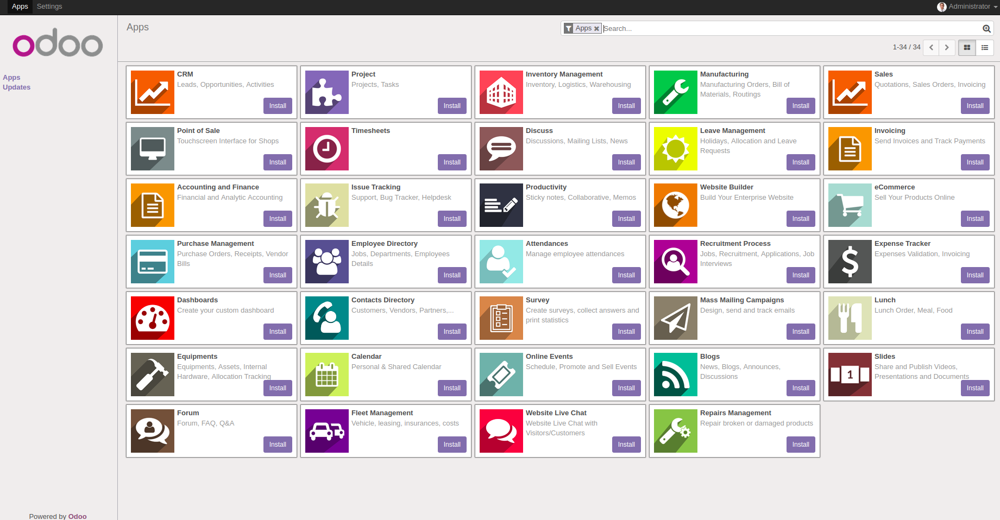

# Usage

Change the folder permission to make sure that the container is able to access the directory:
```
$ sudo chmod -R 777 addons
$ sudo chmod -R 777 etc
```

Start the container:
```
$ docker-compose up
```

Then locate `localhost:8069` to access Odoo 10.0. Log file is printed @ **etc/odoo-server.log**

If you want to run in detached mode, execute this command:

```
$ docker-compose up -d
```

# Custom addons

The **addons** folder contains custom addons. Just put your custom addons if you have any.

# Odoo configuration

To change Odoo configuration, edit file: **etc/odoo.conf**.

# docker-compose.yml

* odoo:10.0
* postgres:9.4

# Screenshots



